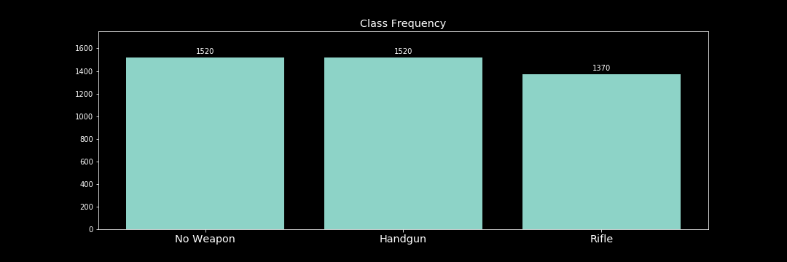
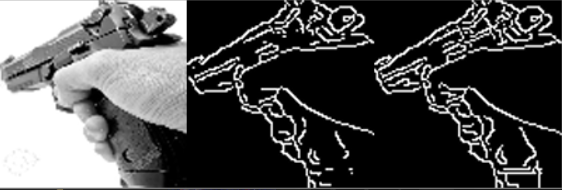

# NN_Weapon_Detection

### Contributers
- Samuel Mohebban
    - Samuel.Mohebbanjob@gmail.com
    - [LinkedIn](https://www.linkedin.com/in/samuel-mohebban-b50732139/)
    - [Medium](https://medium.com/@HeeebsInc)

### Business Probelm
- Mass shoorting have become increasingly prevalent at public gatherings 
- Creating an algorithm that that be integrated into traditional surveillance systems can be used to detect threats faster and more efficiently than those monitored by people 
- In modern surveillance systems, there is a person or group of people, in charge of watching monitors which can span across multiple floors of a given area
- Considering the graphs below, the United States ranks among the top 5 countries in terms of firearm deaths 
    - **Total Deaths** [Data](https://worldpopulationreview.com/country-rankings/gun-deaths-by-country)
    - **Mass Shootings** [Data](https://worldpopulationreview.com/country-rankings/mass-shootings-by-country)
    

### Solution 
- Create a neural network that can be integrated into traditional surveillance systems 
- This neural network will be able to detect whether a firearm is present in a frame, and if so, it will notify authorities/managers of its detection

### Data 
- Data used in this project can be found on my Google Drive 
    - [Weapons](https://drive.google.com/file/d/1EZZKhCk0DK3S9zB53o3nWhKrZUbmN2Up/view?usp=sharing)
    - [No Weapons](https://drive.google.com/file/d/13PP-I6VdRt0mrVkquFxF_Y2HO6S1E0lR/view?usp=sharing)
- Total of 5000 images scraped from IMFDB.com- a website where gun enthusiasts post pictures where an actor is using a model gun within a movie 
    - [Scraping Code](Scraping)
- The reason this website is useful for this problem is because it features pictures of people holding guns as various different angles.
    - After labeling each image with a bounding box, images were moved into two folders - 1. Handgun, 2. Rifle
    - By doing this, the problem became a ternary rather than a binary classification 
- For each image, a bounding box was drawn to find the coordinates of gun within the image.  This process was outsourced to ScaleOps.AI - a company that specializes in data labeling for machine learning 
- For the negative group (no gun), 2433 images that feature a person holding no gun

### Data Processing 
- Before being fed into the neural network for training, each image was resized to (150,150,3)
- For each image with a bounding box, an algorithm was applied to extract the areas where there is a weapon
    - [Code](IOU_SlidingWindow.ipynb)
    - In the figure below, the image on the right was the original photo. Using that photo and the bounding box coordinates, a new photo was created that focuses on the gun only
    - Not only can this technique be used to minimize unwanted noise, but it can also create new data due to the differences in pixels after applying the algorithm.  In this case, for every original photo, two corresponding images were used for training 

- After resizing, edge detection was applied in order to create images where guns are more distinctive than the latter.  Using edge detection resulted in images with a (150,150) shape, which was then resized to (150,150,1) in order to be fed into the convolutional neural network

### Modeling 
- [Modeling Notebook](ModelingNotebook.ipynb)
- Two modeling techniques were tried and compared.
- The labels and their corresponding values are as follows: 
    - 0 = No weapon 
    - 1 = Handgun
    - 2 = Rifle
#### 1) Augmentation

#### 2) No Augmentation 

- Considering the results showsn above, the loss and accuracy were more steady with augmentation
- However, comparing the confusion matrixes in both, the augmentation model was unable to distinguish weapons from non weapons in the test set

### Deployment 
- [Flask Code](FlaskApp)
- The way the deployment architecture works is as follows: 
    1) Input an image or frame within a video 
    2) Apply selective search segmentation to create hundred or thousands of bounding box propositions.  This approach can be considered a sliding window (shown below)
    3) Run each bounding box through the trained algorithm and retrieve the corresponding predictions 
    4) If a gun is predicted, mark the bounding box onto the original image 
    5) if multiple bounding boxes are chosen, apply non max suppression to suppress all but one box, leaving the box with the highest probability and best Region of Interest (ROI)
    

     

- To try this process on your own images, either go to the website where the model is deployed or [this](OpenCVTesting.ipynb) Notebook. Here, you can use your own images or video and see whether it works. 

### Limitations
- Splitting a video into frames and processing each image can take anywhere between 1-3 seconds per image depending on the computer 
- Right now, this cannot be applied to live video due to speed concerns 
- Results have a lot of false positives which are problematic for real world situations

### Future Directions 
- Using Transfer Learning 
    - Using models that are already trained on objects such as people could be decrease false positive rates as it would be better at distinguishing objects that are not guns
    - More data.  Currently, I have 120,000 images from the IMFDB website, however, creating bounding boxes for each image would require a lot of money and time 
    
    
    
    

 
